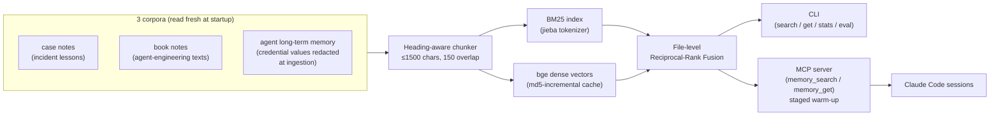

# memory-rag

**A personal-memory RAG that gives my AI coding agent long-term recall** — hybrid retrieval (BM25 + dense vectors + reciprocal-rank fusion) over three corpora of engineering notes, exposed to Claude Code through a custom [MCP](https://modelcontextprotocol.io) server, and held to a golden-set evaluation: **18/18 recall, MRR 0.880** across 937 chunks.

   

> Why: an AI agent forgets everything between sessions. I keep three growing bodies of notes — hard-won incident lessons, textbook study notes, and the agent's own long-term memory files. This project turns them into a retrieval service the agent queries *before* repeating a mistake I already paid for.

## Architecture



## What's interesting about it

**Evaluation as the acceptance gate.** An 18-query golden set (`golden/golden_queries.json`, expectations judged at file level) is versioned in the repo and treated like a test suite: the current baseline is **hybrid 18/18, MRR 0.880 (937 chunks)**; BM25-only holds 17/18 at MRR 0.852. Any change to the golden set requires re-running the eval and recording a new baseline — the ruler stays stable even when a higher score is tempting.

**Cold-start profiling, then fixing the right leg.** First query used to take 35.5s. Per-stage timing showed **88% was `import torch`** (31.4s of Windows DLL loading) — model load was 0.1s and a warm query 0ms. Fix: the MCP server does a *staged main-thread warm-up* right after answering the protocol handshake, cutting the first in-session query from **35s to 0.45s**. (A background-thread import was tried and rejected: the GIL contention made it ~2× slower.)

**Honest degradation.** If vector dependencies aren't installed, hybrid/vec modes automatically fall back to BM25 — and the result explicitly *says so* in a `note` field, so a fallback result is never mistaken for a fusion result.

**Security at ingestion.** The agent-memory corpus may contain `password:`/`token:`/`api_key:` lines. A redaction pass keeps the *keys* searchable ("where do I keep the X credential?") while replacing every *value* with `<REDACTED>` before anything enters an index or leaves through a tool.

**Retrieval findings from a 3-step query-language experiment.** Query in the corpus's language (English queries lost both the lexical leg and the zh-tuned dense leg); rare domain terms beat frequent entity words (which match everything and discriminate nothing); and when you already know the file, `get` beats search.

**MCP hygiene.** stdout is reserved for the protocol stream; all library prints are rerouted to stderr, so no stray `print` can corrupt the JSON-RPC channel.

## Usage

```bash
py -3.12 mr.py stats                     # corpus / tokenizer / vector-layer status
py -3.12 mr.py search "<query>"          # --mode bm25|vec|hybrid (default hybrid)
py -3.12 mr.py eval --mode all -v        # golden-set eval, three modes side by side
py -3.12 mr.py setup-vec                 # install vector deps + pre-pull the bge model
```

Registered as a user-level MCP server (`memory_search` / `memory_get`), available to every new Claude Code session:

```bash
claude mcp add --scope user rh-memory -- py -3.12 <path>/mr_mcp_server.py
```

## Repo layout

| File | Role |
|---|---|
| `mr.py` | CLI entry: search / get / stats / eval |
| `mr_corpus.py` | Corpus loading, heading-aware chunking, credential redaction |
| `mr_index.py` | BM25 + dense index, md5-incremental embedding cache |
| `mr_tools.py` | Shared search/fusion logic for CLI and MCP |
| `mr_mcp_server.py` | MCP server with staged warm-up |
| `golden/golden_queries.json` | 18-query golden eval set (v1, accepted) |

The corpora themselves are personal notes and are **not** included; the golden set documents the retrieval contract. Original operational notes (Chinese): [`docs/ops-notes.zh.md`](docs/ops-notes.zh.md).
